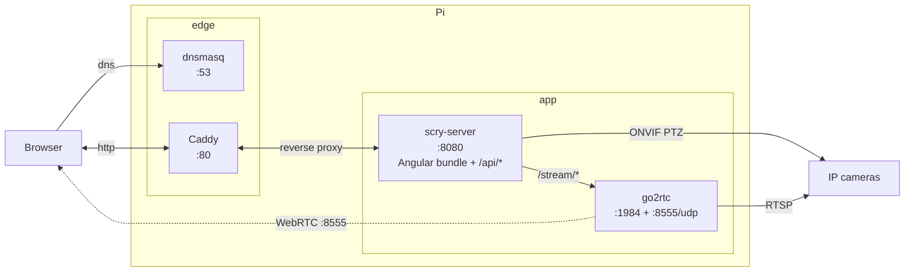

# scry

Self-hosted viewer for IP cameras — RTSP for streams, ONVIF for PTZ, anything
that speaks both. A Raspberry Pi pulls RTSP from each camera, relays to WebRTC
via [go2rtc](https://github.com/AlexxIT/go2rtc), and serves a small Angular
web app for live viewing and PTZ. Tested with TP-Link Tapo C200.

Built for a single household: a few cameras, a few devices, accessed on the
LAN or via whatever VPN you already use.

## Contents

- [Architecture](#architecture)
- [Repo layout](#repo-layout)
- [Prerequisites](#prerequisites)
- [Quick start](#quick-start)
- [Configuring cameras](#configuring-cameras)
- [Local development](#local-development)
- [Deploy](#deploy)
- [Remote access](#remote-access)
- [DNS](#dns)
- [Troubleshooting](#troubleshooting)
  - [DNS doesn't resolve](#dns-doesnt-resolve)
  - [WebRTC stream times out](#webrtc-stream-times-out)
  - [Site loads but stream is a black square (audio works)](#site-loads-but-stream-is-a-black-square-audio-works)
- [Known issues](#known-issues)

## Architecture



The browser hits Caddy on :80, which reverse-proxies to `scry-server` on
:8080. `scry-server` serves the prebuilt Angular bundle (HTML/JS/CSS from
`web/dist/scry-web/browser/`) as static files, and the `/api/*` and
`/stream/*` routes alongside. The Angular client then makes the WebRTC
handshake via `/stream/api/webrtc` (proxied to go2rtc) and media flows
directly from go2rtc to the browser over UDP 8555 — the dotted arrow,
bypassing the rest of the stack.

Two user-mode systemd services hold the app code:

| Service       | Port(s)        | Role                                                 |
| ------------- | -------------- | ---------------------------------------------------- |
| `go2rtc`      | 1984, 8555/udp | RTSP→WebRTC relay, snapshot frames                   |
| `scry-server` | 8080           | Static web bundle + `/api/cameras` + ONVIF PTZ proxy |

Two system services support them, installed and configured by
`scripts/install-pi.sh`:

| Service   | Role                                                              |
| --------- | ----------------------------------------------------------------- |
| `dnsmasq` | DNS on :53; serves a short name for the Pi (`scry`) on the LAN    |
| `caddy`   | Reverse proxy on :80; forwards everything to the Node server      |

The Angular client talks to the Node server, which proxies `/stream/*` to
go2rtc and issues ONVIF `ContinuousMove` for PTZ. WebRTC media flows directly
from go2rtc to the browser on UDP 8555.

Caddy means `http://scry` (no port) works for any client that resolves the
name via dnsmasq. Its config is one site block — see
[`scripts/Caddyfile`](scripts/Caddyfile). When you want HTTPS, switch the
`:80` block to an FQDN site block and Caddy will fetch and renew a Let's
Encrypt cert automatically.

dnsmasq is a thin local resolver — no admin UI, no blocklists, no embedded
webserver fighting for port 80. The committed
[`scripts/dnsmasq.scry.conf`](scripts/dnsmasq.scry.conf) is a template;
`install-pi.sh` substitutes the Pi's own hostname and LAN IP at install time
and writes the result to `/etc/dnsmasq.d/scry.conf`.

## Repo layout

```
cameras.yaml          Camera inventory (id, label, model, RTSP creds, ONVIF)
cameras.example.yaml  Template
models.yaml           Per-model stream paths + capabilities (PTZ, audio)
deploy.env            SSH target + optional overrides (gitignored; see *.example)
server/               Node/Express API + reverse proxy
web/                  Angular client (live view, camera list, PTZ overlay)
scripts/              Systemd units, install + publish scripts
tools/                Local dev helpers (dev-mode go2rtc config etc.)
```

## Prerequisites

- A Raspberry Pi (or any Debian-ish Linux box) with SSH access.
- An IP camera that exposes RTSP (for streaming) and ONVIF (for PTZ). On Tapo
  cameras, RTSP is enabled in the Tapo app → camera settings → Camera Account.
- Node 20+ on your dev machine for builds.
- `install-pi.sh` will install dnsmasq, Caddy, go2rtc, ffmpeg, and Node on the
  Pi automatically — nothing needs to be set up by hand first.

## Quick start

```bash
cp cameras.example.yaml cameras.yaml         # then edit
cp deploy.env.example deploy.env             # then edit PiHost / PiUser
npm install
npm run deploy
```

After the first deploy, the site is at `http://scry` (LAN, via dnsmasq) or
`http://<pi-ip>:8080` (LAN, direct to Node, bypasses Caddy).

## Configuring cameras

Each camera is one entry in `cameras.yaml` (gitignored):

```yaml
cameras:
  - id: camera_one          # used in URLs, must be unique, snake_case
    label: Front door       # shown in the UI
    model: tapo-c200        # key into models.yaml
    network:
      ip: <camera-ip>
      user: <rtsp-username>
      pass: <rtsp-password>
```

`models.yaml` defines what each model can do (PTZ, audio, available stream
qualities and the RTSP paths to reach them). Add a new entry there if you
have a model that isn't listed. The go2rtc config is regenerated from both
YAMLs on every deploy.

## Local development

```bash
npm install
npm run dev
```

Boots go2rtc and the Node server on your dev machine, with the Angular dev
server proxying through. The dev process connects directly to each camera by
its RTSP URL.

**Caveat — subnet collisions:** if your dev machine's LAN happens to share a
subnet with the camera's LAN, *and* you're remote on a VPN that routes the
camera's subnet, the dev machine's directly-connected route wins over the
VPN's. Symptom: connect-time errors like `ERR_NETWORK_ACCESS_DENIED` or
`General failure`. Either run dev on the camera's LAN, add a host-specific
route through the VPN interface, or just iterate against the prod deployment.

## Deploy

```bash
npm run deploy
```

Builds server + web, copies artifacts and configs to the Pi over SSH,
regenerates `go2rtc.yaml` from `cameras.yaml` + `models.yaml`, runs
`install-pi.sh` (idempotent system setup — installs missing packages, syncs
dnsmasq/Caddy config, reloads units), then restarts the user-mode services.
Overrides for host/user/dir live in `deploy.env`.

`install-pi.sh` only does work when something actually changed: package
installs are gated on `command -v`, config copies on `cmp`, service restarts
only happen when their config changed or the service isn't running. Sudo
prompts only appear when something genuinely needs sudo. Safe to run on
every deploy.

## Remote access

This repo doesn't include VPN config — services only listen on the LAN. If
you want to reach the site off-LAN, set up a VPN that places the client on
the Pi's LAN (PiVPN on the Pi is a ~5-minute install of WireGuard). With the
VPN connected, every URL in this README works the same as on LAN.

Two practical bits worth knowing if you do this:
- **Set the VPN client's DNS to the Pi's LAN IP** so `scry` resolves through
  dnsmasq while the tunnel is up.

## DNS

[`scripts/dnsmasq.scry.conf`](scripts/dnsmasq.scry.conf) is the template
source of truth for local names. `install-pi.sh` substitutes `__PI_IP__` and
`__PI_HOSTNAME__` from the Pi's actual values, so the same template works on
any Pi. To add another name (`media → some.other.host`, etc.), add a
`host-record=` line and re-deploy.

For LAN-wide name resolution (so every device on the LAN uses the Pi without
extra setup), set your router's DHCP DNS to the Pi's LAN IP.

## Troubleshooting

### DNS doesn't resolve

- **Browser DoH is on.** Chrome / Edge / Firefox each have a "Secure DNS"
  setting that bypasses the OS resolver entirely. Turn it off in each
  browser that needs to reach local names (`chrome://settings/security`,
  etc.).
- **Android Private DNS is on.** Settings → Network → Private DNS. Even
  "Automatic" sends queries to a public DoH provider, bypassing your VPN's
  DNS line. Set to **Off** while connected. iOS doesn't have this footgun.
- **VPN client `DNS =` wasn't reloaded.** Most VPN clients only re-read the
  DNS setting on tunnel activation. Toggle off, toggle on.
- **Single-label name on Windows.** Windows' DNS Client refuses to query
  bare single-label names (`scry`). Use the `.lan` form (`scry.lan`) from
  Windows clients. Non-Windows clients handle both.
- **dnsmasq isn't running.** `sudo ss -lunp | grep :53` should show
  `0.0.0.0:53` bound to `dnsmasq`. If not, `sudo systemctl restart dnsmasq`
  and check `journalctl -u dnsmasq -n 50`.

### WebRTC stream times out

- Open `chrome://webrtc-internals` while reproducing. If signalling stalls
  at `have-local-offer`, the POST to `/stream/api/webrtc` is hanging —
  usually means ICE gathering is taking longer than the client-side
  timeout. The web service caps ICE gathering at 2.5s; the timer is in
  [`web/src/app/services/go2rtc-webrtc.service.ts`](web/src/app/services/go2rtc-webrtc.service.ts)
  if it ever needs raising.

### Site loads but stream is a black square (audio works)

`<video>` is rendering at near-zero size. Almost always means a parent host
element collapsed to `display: inline`. Check `:host { display: flex/block }`
on the routed component.

## Known issues

- **`.local` names don't traverse VPNs.** mDNS doesn't cross routing
  boundaries. Use the bare names (resolved by dnsmasq) or an IP directly
  when off-LAN.
